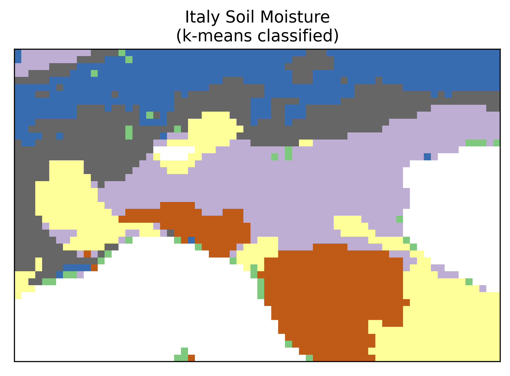
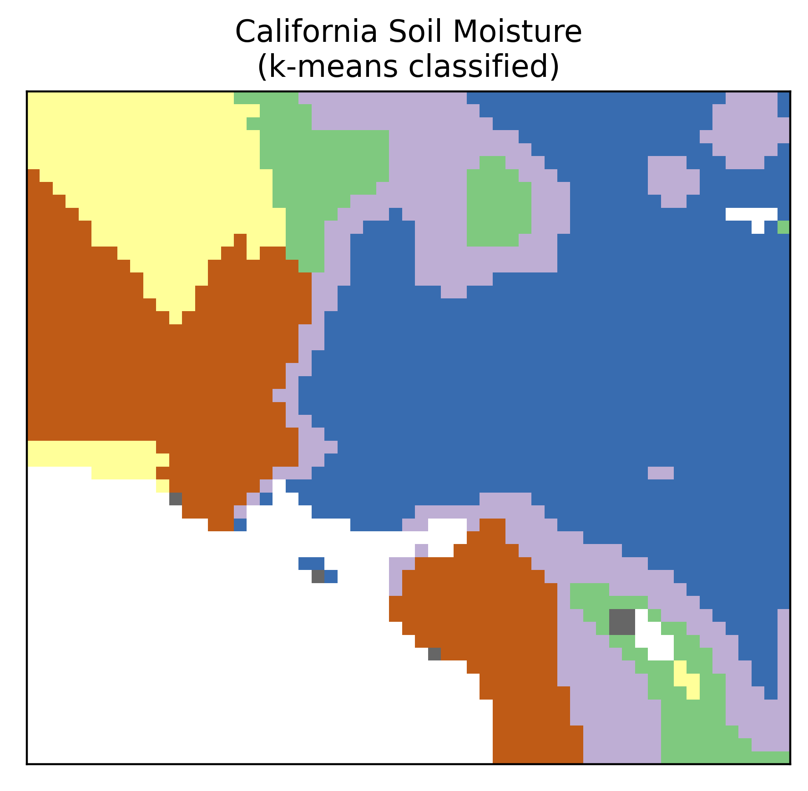

## Data

In `SMAP_data` directory there a soil moisture data file (`.h5`) for each of the 366 days in 2020.
These files contain a morning reading (`AM`) and an afternoon reading (`PM`).
Each file is global, but has `-9999` values where there were no values measured (either because the pixel represents sea/water or because the satellite didn't pass over at that day/time).

The data is 9 km x 9km resolution.

### Quick-access 
It takes a while to open a `.h5` file for every day of the year when in fact we are only interested in a small crop.
There are saved crops of the data therefore in the areas corresponding to the AOIs used with the AI4EO Air Quality dataset:
* `Italy_data.npy` contains a cropped 45 x 70 pixel area (732 data points in time)
* `California_data.npy` contains a cropped 52 x 59 pixel area (732 data points in time)
* `SouthAfrica_data.npy` contains a cropped 56 x 52 pixel area (732 data points in time)

## Labels

The `load.kmeans_classify()` function takes the time series and clusters them.
The cluster labels can be used for the purposes of this lab/demo.

